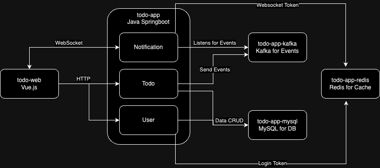

# todo-app

A simple todo app using Spring Boot

## Running Spring TODO App locally
`docker-compose up --build`

This command will:
1. Download the application and DB images
2. Build the application using Maven
3. Start the application and DB containers
4. Create the database schema
5. Seed the database with initial data from start.sql
6. Configure and start Kafka, Redis, and Zookeeper
7. Application ready to be called at http://localhost:8080 and Websocket at ws://localhost:8080/ws?token={token}
## Basic Architecture Diagram

## API Documentation
1. [Swagger](http://localhost:8080/swagger-ui.html) (Make sure you have started the application)
2. Postman Collection: Inside postman/ folder, you will find the collection and environment file to import in Postman.

## Features Implemented
1. Todo CRUD
2. Todo filtering
3. Todo sorting
4. User Authentication and Registration
5. Todo sharing with multiple users
6. Todo update notifications using Websockets and Kafka events

## Feature Wishlist
1. Tags
2. Pagination & Endless scrolling
